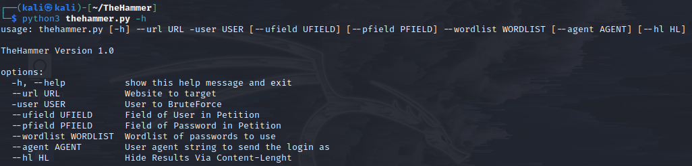

# TheHammer
Herramienta echa en python para hacer ataques de fuerza bruta a login de paginas web de manera automatizada y sencilla de usar.
#

# Instalar
$apt update

$apt upgrade

$git clone https://github.com/RIP-Network/TheHammer

$cd TheHammer

$bash install.sh

$python3 thehammer.py -h

# Menu
TheHammer Version 1.0

options:

-h, --help           show this help message and exit

--url URL            Website to target

-user USER           User to BruteForce

--ufield UFIELD      Field of User in Petition

--pfield PFIELD      Field of Password in Petition

--wordlist WORDLIST  Wordlist of passwords to use

--agent AGENT        User agent string to send the login as

--hl HL              Hide Results Via Content-Lenght

# Info
  

    <a href="https://github.com/RIP-Network/TheHammer/issues/new?assignees=&labels=bug&template=bug_report.md&title=">Report Bug</a>
    ·
    <a href="https://github.com/RIP-Network/TheHammer/issues">Request Feature</a>
  

      
    

 
